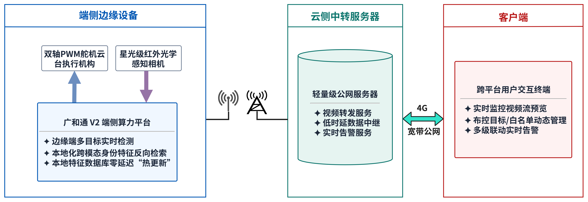

# ⚡ 作品名称
> 赛事：全国大学生嵌入式芯片与系统设计竞赛
> 奖项：一等奖
> 年份：2026
> 平台：广和通 SC171 开发套件 V2 
> 团队：熬走一队是一对 · 西安邮电大学 导师：艾达  队长：盛冬梅  队员：王天浩 田琳烨

## 📖 作品简介
灵眸卫士是一套面向全天时移动安防巡检的跨模态边缘身份识别系统，基于广和通 SC171V2 嵌入式计算平台，可在园区、校园、步行街、车站广场及大型活动等场景本地运行。它针对夜间/弱光成像差、远距离人脸像素占比低、红外与可见光模态差异大、云端识别延迟高、移动目标易丢失等痛点，自建 1m–8m 跨模态跨距离人脸数据集 CMCD-F，通过改进非对称 CycleGAN 将红外人脸重建为可见光人脸，并串联轻量人脸检测、混合目标跟踪、云台锁定与端侧特征比对，实现不依赖云端的实时身份识别。实测在 12mm 镜头、8m距离、夜间红外人脸仅40×40像素时，识别准确率仍达 90%。系统支持网页/安卓双端管控、弹窗+邮件告警和人脸库热更新，为低成本、可移植的 24 小时边缘安防提供方案。

## 🧠 核心功能
- **跨模态红外人脸识别**:采用改进非对称CycleGAN与身份保持约束，将红外/近红外人脸重建为可见光人脸，适配1–8m距离，夜间40×40小尺寸人脸识别准确率达 90%。
- **端侧实时检测与混合跟踪**:基于轻量化 SCRFD 完成人脸检测，融合 ByteTrack 与 CSRT 提升动态巡检中目标连续性，在颠簸、遮挡场景下稳定维持轨迹。
- **异常告警联动**:检测到未注册或重点关注人员时，支持界面弹窗、文字提示和邮件告警，可自定义告警冷却时长与多级推送规则。
- **实时身份识别与画面叠加**:对视频流逐帧完成检测、跟踪和跨模态比对，识别结果与追踪 ID 直接叠加显示在监控画面中。
- **全自动寻人流程**:客户端上传目标人像后，任务自动下发至巡检终端，平台 24 小时不间断比对，发现可疑目标立即弹窗并邮件推送。
- **端云边协同与移动部署**:端侧本地完成检测、跟踪、识别与决策，云侧仅做视频转发和告警中继，配合自研防水减震吊舱，可适配手持、车载、无人机等载体。

## 🏗️ 系统架构
系统采用“端—云—边”三层协同架构：端侧完成图像采集、人脸检测、多目标跟踪与跨模态身份识别；云侧负责视频转发、低时延数据中继与实时告警服务；客户端提供实时预览、远程布控、人脸库管理和告警联动。


## 📂 目录结构

```text
├── README.md                         # 项目总览、目录导航与启动入口说明
├── docs/                             # 技术报告、设计材料、测试与部署文档
│   └── README.md                     # 文档发布与脱敏规范
├── hardware/                         # 硬件资料、结构设计和物料清单
│   ├── bom.CSV                       # SC171、摄像头、云台、电源等物料清单
│   ├── mechanical/                   # 外壳 STEP 与电池仓面板 DWG 文件
│   └── pcb/                          # PCB 源工程与制造文件预留目录（待补充）
├── firmware/                         # STM32 等控制器底层固件
│   └── mg90s舵机控制/                # MG90S 双轴云台串口/PWM 控制工程
├── edge_computing/                   # SC171 设备侧推理、跟踪和控制逻辑
│   ├── algorithm/                    # 业务算法工程
│   │   └── AeroFace Edge/            # 人脸检测、识别、跟踪、事件上报与云台联动
│   ├── ai_model/                     # CycleGAN、FaceNet/AdaFace 训练与评测资源
│   └── requirements.txt              # 设备侧 Python 依赖清单（待锁定版本）
├── cloud/                            # 服务端消息中转与客户端展示
│   ├── iot_platform/                 # WebSocket 服务与 SRS 启动脚本
│   └── web_frontend/                 # uni-app 客户端与 HTML 可视化页面
└── tools/                            # 模型量化、ONNX/TFLite 转换与调试工具
```

各目录均提供独立 README，包含职责、使用方法、验证步骤和安全注意事项。涉及人脸图像、特征库、Token、设备地址和运行日志的文件仅可存放在受保护的部署环境，不能提交至仓库。

## 🚀 快速开始

本项目由设备侧、服务端和前端组成。建议先完成设备侧离线验证，再接入服务端，最后配置客户端；不要使用真实人脸库或生产凭据进行首次联调。

#### 1. 获取代码并阅读模块说明

```bash
git clone <仓库地址>
cd FiBoom-project-main
```

开始前请阅读 `edge_computing/algorithm/AeroFace Edge/README.md`、`cloud/iot_platform/README.md` 和 `cloud/web_frontend/README.md`。这些模块的运行条件不同，不能沿用旧版 `edge/`、`web/` 或 `app/` 路径。

#### 2. 在 SC171 V2 上启动边缘识别服务

前置条件：设备已具备项目验证过的 Python、AIDLite、OpenCV、NumPy、WebSocket 和串口依赖；摄像头、模型文件与可选云台已正确连接。

```bash
cd "edge_computing/algorithm/AeroFace Edge"

# 在设备的受保护环境中注入 FACE_* 配置；不要把真实值写入仓库。
# 先确认 models/ 下的检测与识别模型存在，再启动。
python main.py
```

首次启动建议暂不启用云台、推流和远程事件服务，只验证摄像头画面、检测框、跟踪 ID 与本地帧率。离线稳定后，再按照 `.env.example` 中的变量名由系统服务、容器或安全配置系统注入服务地址和令牌。

#### 3. 启动云端消息与流媒体服务

前置条件：Linux 服务器已安装 Python、Docker，并完成防火墙、TLS、反向代理和最小权限账号配置。`start.sh` 中的端口映射当前需要按部署环境补全，审查完成前不要直接运行。

```bash
cd cloud/iot_platform
# 审查并配置 start.sh 的端口、镜像与候选地址后再执行：
bash start.sh
```

启动后使用测试令牌和模拟消息验证 WebSocket 认证、心跳、重连和异常报文拒绝；日志中不得记录令牌、原始图像或特征向量。

#### 4. 运行客户端

移动端工程位于 `cloud/web_frontend/APP/`，推荐使用 HBuilderX/uni-app 打开；浏览器端静态页面位于 `cloud/web_frontend/HTML/main.html`。安装或构建前端依赖前，应先将服务地址配置为测试环境，且不提交本地环境文件、`node_modules/` 或 `unpackage/`。

#### 5. 最小验收清单

1. 设备侧可以连续读取摄像头，并输出稳定的检测框和跟踪 ID。
2. 空人脸库下，未知目标不会被误标为已注册身份。
3. 服务端拒绝无效认证和异常消息，重启后客户端能够退避重连。
4. 前端能展示脱敏的测试事件，并正确处理断流和网络恢复。
5. 停止服务后，摄像头、串口、推流与后台进程均被释放。
